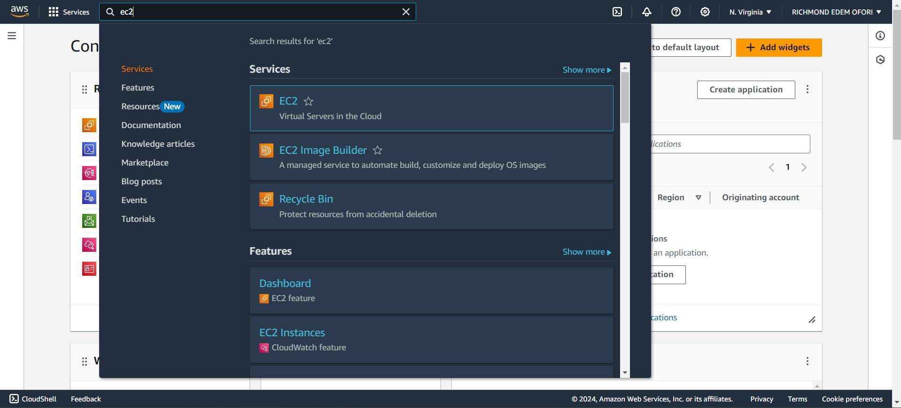

# LAMP STACK IMPLEMENTATION ON AWS EC2
This project demonstrates the implementation of a LAMP (Linux, Apache, MySQL, PHP) stack on an AWS EC2 t2.micro instance running **Ubuntu 24.04 LTS**. Follow these steps to recreate the setup.
- Step 0 - Preparing the prerequisites
- Step 1 - Installing Apache
- Step 2 - Installing MySQL
- Step 3 - Installing PHP
- Step 4 - Creating a virtual Host for Your website using Apache
- Step 5 - Enabling PHP on the website
## STEP 0
**Prepare the prerequisites**

**AWS Account Setup:**

Create an AWS account or log in to your existing one.


**Launch EC2 Instance:**

Navigate to EC2 in the AWS Management Console.


Launch a new EC2 instance using the Ubuntu 24.04 LTS image.
Choose the t2.micro instance type.
Configure security groups to allow necessary inbound traffic (SSH, HTTP).


Create or select an existing key pair and download the private key (.pem file).


Edit the inbound and outbound rule


Connect to Your Instance via SSH client:
 


Open your terminal (I used windows powershell for this project) and run this:

```ssh -i "Private-key-name.pem" ubuntu@<Public IP address>```


